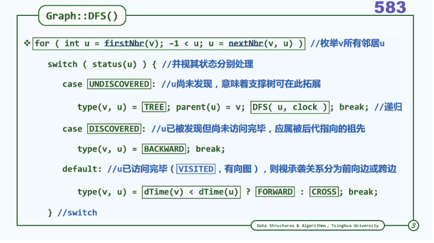

## 图(Graph)
### 王道烩  2018.8.5

### 图的概念
$$G = (V ; E)$$
vector和list以及tree都是图的特列。
但是一般不讨论带自环的图。

上述图片中，左边的是我们讨论的图，右边的不是我们讨论的图。

### 有向无向图
若边存在方向，则称作有向图，否则称为无向图。
因此主要研究有向图，因为无向边可以通过增加一对有向边来实现。

### 图的表示

#### 邻接矩阵(adjacency matrix)
具有n个节点的图邻接矩阵为n乘n的。若i节点和j节点直接存在一个边，权重为w，那么举证的ij元素就是w。

#### 关联矩阵
若n个节点e条边，则n行e列
若节点i和边j之间存在关联关系，则ij记为1，否则记为0.可以看出每一列只有两个1.

### 广度优先搜索(BFS)

通过遍历，能够将树这种半线性结构变成线性结构。
所以需要定义一些遍历，将图通过遍历变成半线性结构，也就是树。

#### 算法
始自S顶点，先访问S定点，然后依次访问S所有的尚未访问的邻接节点，
然后在依次访问邻居节点的邻居中没有被访问的节点，依次类推。

广度优先搜索相当于树的层序遍历，最终能够得到一棵生成树。
既然和树的层序遍历类似，那么就可以借助队列这个数据结构来实现。
实现如下：

#### 多联通图的遍历
通过在上述广度优先搜索外嵌套一个循环，这个循环依次判断所有节点的状态，如果发现这个顶点没有被访问过，就将这个节点作为起始节点进行广度优先搜索。

实现如下：

其实现的复杂度是O(n+e).

#### 最短路径
图的BFS搜索，就是按照所有顶点和源点之间的距离来划分的。

### 深度优先搜索(DFS)

可以通过迭代加循环的方式来实现图的深度优先搜索：

对于多通量，可以使用和BFS相同的处理方法：

