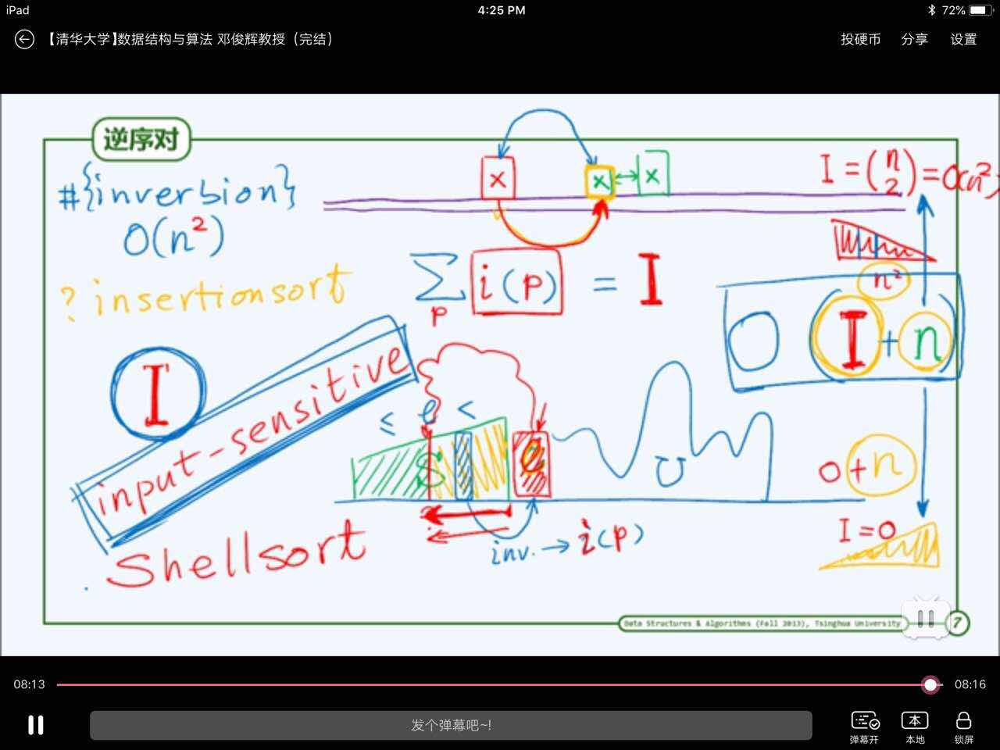

## 排序算法 
####  2018.8.2 

### 1.冒泡排序
冒泡排序的最基本的想法是不断的扫描和交换，直到整个序列不存在逆序对。
在冒泡排序中，每一次交换都能够使一个元素处在正确的位置。比如第一次扫描交换，能够将最大的元素放在最右边，第二次扫描交换，能够使得第二大的元素处在倒数第二个位置。这能够通过反证法证明这个的正确性。
其次，冒泡排序还存在一个特点，就是在一趟扫描的过程中，发生最后一次交换的元素位置，那么在这个位置之后的所有的元素已经是有序的。这同样能够采用反证法来证明。其实冒泡排序就是将大的元素逐渐向队尾挪的过程。
基于上述讨论，冒泡算法在最坏的情况下的复杂度是O(n方),在最后的情况下是O(n)，而且冒泡排序是稳定的排序方法。

具体实现：
```cpp

/*
 * BubbleSort.cpp
 *
 *  Created on: Aug 3, 2018
 *      Author: wangdh
 */

#include <iostream>

using namespace std;

void BubbleSort(int *A, int size)
{
    for (int last = size - 1; 0 < last;)
    {
        bool sorted = true; //设置变量判断当前扫描是否有序
        int last_temp;      //设置变量记录当前扫描最后一次交换的位置
        for (int j = 0; j <= last - 1; j++)
        {
            if (A[j] > A[j + 1])
            {

                int temp;
                temp = A[j];
                A[j] = A[j + 1];
                A[j + 1] = temp;
                last_temp = j;  //记录当前扫描最后一次交换的位置
                sorted = false; //设置sorted为false
            }
        }
        if (sorted == true)
            break;        //如果已经有序，则终止
        last = last_temp; //将最后一次扫描的位置作为最后的位置
    }
}

int main()
{
    int A[10] = {3, 2, 1, 4, 5, -1, -10, 100, -1000, 90};
    BubbleSort(A, 10);
    for (int i = 0; i < 10; i++)
        cout << A[i] << endl;
    return 0;
}
```

### 2.归并排序
归并排序的思想是分而治之的思想，先将一个无序的，分成两个规模较小的无序的，然后分别实现有序，然后再将两个有序的向量进行合并，实现规模更大的有序。最终可以使用递归的想法来实现。复杂度是O(nlogn),最终要的是要实现将两个有序的向量实现合并的操作，这一步的操作的复杂度是O(n)。分别维护两个指针指向两个有序向量的当前未合并的最小的元素，然后比较之，然后不断地往后挪，直到两个向量都实现了合并。

具体实现如下：
```cpp
/*
 * MergeSort.cpp
 *
 *  Created on: Aug 3, 2018
 *      Author: wangdh
 */

#include <iostream>
using namespace std;

void Merge(int *A, int lo, int mi, int hi)
{
    int *temp = new int[mi - lo]; //将前边一部分copy一份
    for (int i = lo; i < mi; i++)
    {
        temp[i - lo] = A[i];
    }
    for (int i = 0, j = mi, k = lo; i < (mi - lo) || j < hi;) //进行合并，i指向前一部分未合并的最小值，j指向后一部分未合并的最小值。
    {
        if (hi <= j || ((i < (mi - lo)) && (temp[i] <= A[j]))) //若j越界或者i未越界且temp[i] <= A[j] ,则讲temp[i]合并到最终序列中
            A[k++] = temp[i++];
        //else if ((mi-lo) <= i|| A[j] < temp[i])
        else //否则，讲A[j]合并。
            A[k++] = A[j++];
    }
    return;
}

void MergeSort(int *A, int lo, int hi)
{
    if ((hi - lo) == 1)
        return;
    int mi = (lo + hi) / 2; //求出中点
    MergeSort(A, lo, mi);   //递归调用排序算法
    MergeSort(A, mi, hi);
    Merge(A, lo, mi, hi); //将两个有序的合并
    return;
}

int main()
{
    int A[10] = {1, 3, 2, -1, 9, 23, -100, 43, 2, 7};
    MergeSort(A, 0, 10);
    for (int i = 0; i < 10; i++)
        cout << A[i] << endl;
    return 0;
}

```

### 选择排序
选择排序是一种比较直观的排序方法。首先也是不断地对序列进行扫描，然后，每次扫描找到剩余序列的最大的元素位置，然后将这个元素和其正确位置的元素进行交换，这样就能够将问题的规模减小，从而能够实现排序。
其和冒泡排序非常的像，但是最大的不同就是，冒泡排序只要发现逆序对就进行交换，但是选择排序只进行一次交换，这在交换的次数上就大大减少了。但是同时和改进的冒泡排序而言，这样的方法不能够记录已经存在有序的位置，所以选择排序在最好的最坏的条件下都是O(n方)的复杂度。

具体实现：


### 插入排序
插入排序的主要思想是，如果某一元素前面是有序的，那么我讲这个元素插入到这个有序的序列中，这样就将有序的序列规模扩大了，这样就能够逐步扩大规模，直至使挣个序列处于有序状态。
但是插入排序涉及两个操作。一个是需要在有序的序列中找到合适的位置，第二个是将这个元素插到这个位置中。这两个操作之间是一种trade-off。对于不同的数据结构，上述两种操作复杂度是不同的。对于vector而言，可以使用二分查找等策略是的查找的复杂度变为O(logn)，但是插入的复杂度是O(n)。对于list而言，查找的复杂度是O(n)，但是插入的复杂度是O(1)。

具体实现如下:


### 逆序对
为了深入理解插入排序，引入逆序对。
**逆序对**是反应一个序列乱序程度的量。一个元素的逆序对个数是这个元素前面的所有比这个元素大的元素的个数。所以整个序列的逆序对的个数是所有元素的逆序对的个数之和。在插入排序中，某一个元素需要的查找和插入的操作，都和这个元素的逆序对的个数直接相关联的。所以逆序对的个数决定插入排序的具体问题的复杂度。而具体问题的逆序对可能变化非常大。所以插入排序是对**输入敏感**的
