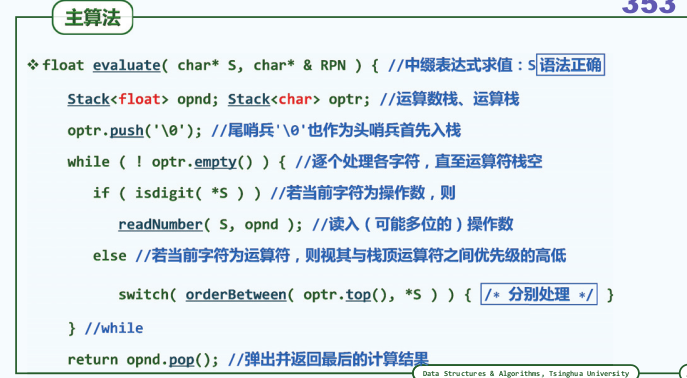

##栈（stack）
### 王道烩  2018.8.4

### 栈典型应用场合
- 逆序输出: 输出次序与处理过程颠倒，，递归深度和输出长度不易预知；如进制转换

- 延迟缓冲： 线性扫描算法中，在预读足够长之后，方能确定可处理的前缀。如中缀表达式求值

- 递归嵌套： 具有自相似性的问题可递归描述，但分支位置和嵌套深度不固定。如函数调用

- 栈式计算： 基于栈结构的特定计算模式。RPN计算求值，中缀表达式求值。

### 栈混洗(stack permutation)
栈混洗就是将一个栈中的元素通过一个中转栈然后转移到另外一个栈中。
对于长度未N的栈，栈混洗的所有种类数为多少呢？

考察第一个进入S栈栈底的元素，其出栈的次序未k，那么前K-1个元素的栈混洗数和后N-K个元素的栈混洗数是相互独立的。

$$SP(N) = \sum_{k=1}^{N}{SP(k-1)*SP(n-k)}$$

$$SP(1) = 1$$

上述递推方程的解是catalan数：
$$SP(N) = \frac{(2N)!}{(N+1)!N!}$$

### 栈混洗的甄别
对于输入序列的一个任意排列，如何判断其是否是栈混洗？
对于n为3的栈，一共有5中栈混洗数。如栈为123 ，则不可能为312

通过观察，我们可以知道任意单个元素其相对位置确定了，那么混洗之中必然不能出现上述模式。同时，有人也证明了这是个充分条件。这样能够得到一个n三次方的复杂度的算法。

进一步的，可以得到下面的结论：

这样的话能够得到一个n方复杂度的算法。

再进一步，可以采用模拟栈混洗过程，实现n复杂度的算法。

对于输出序列中的任何一个元素我们都采用一种贪心的原则以S为中介 将其从A转移至B中只要这个贪心的过程能够持续进行并最终将所有的元素顺利地从A转入B中那么我们就可以判断它是一个栈混洗反之 每次通过pop操作试图从S中弹出当前的元素时如果S已经变空或者要弹出的元素 虽然在S中存在但却非最顶端的元素我们都可以立即判断这个栈混洗是非法的。

### 栈混洗和括号匹配的联系
将每一个原来栈中的元素看做一对括号，那么对于栈S而言，一共有n次push 和n次pop操作。将每一次push操作对应于左括号，每次pop操作对应有右括号。
所以n个元素合法的栈混洗序列与n对括号合法的括号匹配表达式之间存在一一对应的关系。n个元素的栈混洗有多少中，n对括号所能构成的合法表达式也就有多少种。

### 中缀表达式求值
在常用的计算工具中，对于输入的计算表达式中，进行计算出正确结果。所采用的方法都是大同小异。

括号匹配算法我们总是师徒在表达式中找到一对彼此紧邻的相互配对的括号。然后可以将这一对括号删除。然后与那时问题的规模减少，这就是减尔治之的策略。对于中缀表达式而言，我么也能够这样处理。我们找到能够优先计算的子串，然后将其结果计算出来放到位置上，这样继续下去，就能够算出结果。这样一个想法如果我们以一种线性扫描的次序来处理，那么我们扫到一个运算符的时候，不能够确定这个运算符是不是能够运算的，也就是我们的计算次序和扫描次序不一定完全一致，就像上面说的延迟缓冲差不多。我们可以借助一个栈的结构，将所有扫描过的部分保存为一个栈，然后在扫描的过程中判断在局部有足够高的优先级的部分，然后进行计算。已经扫描过的部分但是还不足以计算的部分被栈缓冲起来，这样就能够逐步蚕食，将未扫描的部分扫描并且处理掉。

但是还是具有一个问题，如果将运算符和操作数都存放在一个栈中，那么操作数会将操作符盖住无法取出栈顶的操作符和当前操作符，从而无法能够比较两者之前的优先级来确定是否能够进行操作，所以我么需要使用两个栈，一个栈用来存放操作数，一个栈用来存放操作符，这样就能够解决问题。

算法的主函数如下，现将一个哨兵push到操作符栈栈底，便于与最后的字符串末尾进行匹配。然后进行下续操作，主要操作是判断当前操作符和栈顶操作符之间的优先级之间的关系这种关系能够**制作出一张二维表格来存贮，进而解决量少但逻辑复杂的表达式的值。**

### 逆波兰表达式(Reverse Polish Notation)
RPN表达式也是后缀表达式，不需要括号来表示运算的次序。最先出现的操作符就是最先应该被执行的操作符。
所以说可以直接将所有RPN表达式依次入栈，如果出现了一个操作数，就从栈顶弹出这个操作符需要的操作数的个数，然后进行运算并将结果push到栈中。

那么如何能够得到一个表达式的RPN呢？
手工方法就是将所有的子表达式按照优先级的顺序加上括号，然后将所有的操作数放在起对应的括号后面，然后将括号去除 就能够的到我们需要的RPN，这样从逻辑上也能够理解起正确性。

其实在进行中缀表达式的操作的时候，我们就已经实现了这样的功能，因为中缀表达式操作符和操作数出栈的顺序就是RPN的字符的顺序。我们在进行中缀表达式求值的时候，如果遇到一个操作数，那么直接将其放到RPN栈中即可，如果遇到了需要弹出操作符的时候，我们只需要将这个操作符压入RPN栈中即可，这样最后得到的RPN栈中的从栈底到栈顶的顺序，就是这个表达式的RPN表达式。从逻辑上来将，这个RPN表达式就相当于记录下来了整个中缀表达式的运算次序。然后进行上述操作，就能够得到RPN。其实为了最终能够从栈底开始输出RPN，可以使用队列的数据就够来存储RPN。

### 自己的思考
栈这种数据结构的特点我觉得第一点就是能够逆序输出。
当然最重要的是那种我们需要边走边看来处理问题这种思想。而且不知道什么时候能够处理一个小的问题，解决小问题也只需要使用到不远时间的信息。那么可以使用栈来将前面的数据进行缓存，通过pop来取出我们解决问题需要的信息。
栈混洗是一个比较有意思的问题。