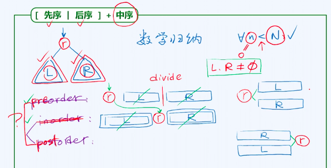
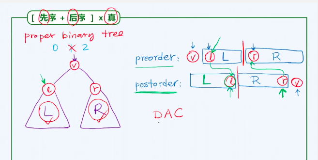

## 树(tree)
### 王道烩  2018.8.5

### 树的概念
vector和list是线性结构，但是两者的静态操作和动态操作的消耗是不同的。首先，vector的静态操作查找需要常数时间，但是list需要O(n)的时间。但是Vector的动态操作，插入和删除需要O(n)的时间，list只需要常数时间。所以两者各具优缺点。
树这种结构结合了两者的优点，为了和图相区别，称之为半线性结构。

树主要表示层次关系的表示，如文件系统，URL等。

树也是一种图，表示顶点(vertex)和顶点之间的关系。可以指定任意一个节点为根(root)，那么就可以称作有根树。
$$T = (V , E)$$
节点数|V| = n, 边数|E| = e.

一个节点的孩子的数目称为这个节点的度(degree)。可以证明，一棵树的边数等于所有节点的度数之和，为节点数减一。所以在衡量相关复杂度的时候，可以以N作为参考。

在一个图中，如果任意两个节点之间均有路径，称作连通图。
如果不含环路，那么称作无环图。
树又称作无环联通图，极小联通图，极大无环图。

通过每个顶点和根节点直接的边的个数可以赋予每一个节点一个指标。从而可以知道这个**节点的深度**。

在任意深度，一个节点的祖先比然唯一，但是一个节点的后代未必唯一。
根节点没有祖先，深度为零。叶子节点没有后代。
**树的高度**是所有叶子节点深度中的最大者。
**节点的高度为其字数的高度**

任一节点的高度和深度之和，不超过全树的高度。

### 树的表示
从逻辑上表示树。

每一个节点只有一个父亲，所以可以将将每一个节点保存其父节点就可以将一棵树保存下来。这样对于查询有一个节点的父亲节点是非常方便的，但是查询某一节点的孩子节点就不方便了。

同时也可以将一个节点所有的孩子保存为一个list。这样能够优化向下查询的效率。如查找某一个节点的孩子。但是这样查询一个节点的父亲的效率就会降下来，可能需要遍历整颗树。

所以可以将上述两者的优势结合起来，同时将两者的父亲和孩子同时保存下来。

长子兄弟法：每个节点只记录起长子引用和兄弟引用。

### 二叉树(binary tree)
节点度数不超过2.
同一节点的孩子和子树，以左右区分。左孩子，右孩子。
深度为k的节点，之多是2的k次方个。
对于一棵二叉树而言，其宽度增长非常快，但是其高度增长及其缓慢，为log级别。

#### 真二叉树
真二叉树的每一个节点的出度都是偶数，为0或2，不含有度数为1的节点。这种添加完全只是假想的，不是真的存在，这便于后面对算法的理解。

#### 通过二叉树描述多叉树
将每一个节点的左孩子保存起长子，右子树保存其兄弟，那么二叉树就能表示任意一棵树。所以二叉树能够表示任意树。所以二叉树是最非常重要的一种数据结构。

#### 二叉树的遍历
遍历能够将树这种版线性结构转化成线性结构。
遍历是按照某种顺序将一棵树中所有的节点访问一次。

- 先序遍历 根节点先访问，然后左子树，然后右子树 
- 中序遍历 先访问左子树  然后根节点 然后右子树
- 后序遍历 先访问左子树  然后右子树 然后根节点

### 先序遍历的实现
#### 递归实现
递归实现是非常简单的。但是效率还是不是非常高。
先序遍历是一种尾递归形式，就是递归调用发生末尾，这种尾递归形式非常容易该写生迭代形式，只需要一个栈。

#### 迭代实现
第一种方法：取一个栈，现将根节点入栈，然后弹出元素并访问，然后将右孩子入栈，再将左孩子入栈。然后继续循环。

第二种方法：通过观察，可以看到，先序遍历是一种总是优先希望向左孩子访问的一种倾向，如果向左走不通之后，就向右一次，然后 继续向左走，如果没有路可走的话，那么就回溯到上一层。这样不断的进行下去，直到访问整棵树的节点。
一直向左走下去的称作左侧链。同时还存在一个右子树。先序遍历是先自顶向下遍历左侧连，然后自底向上地遍历右子树。

所以每次都是访问当前节点，然后将当前节点的右孩子入栈，然后再访问这个节点的左孩子。然后持续迭代下去。

### 中序遍历
递归实现非常简单。

#### 迭代实现
通过观察，可以将二叉树变成左侧连，右子树的形式。然后每次访问的时候，在任何一个局部，一个节点总是访问它的左孩子，然后左孩子访问完之后，将自己访问，然后访问右孩子。

能够到达的顺序是从上到下，而访问的顺序却是自下而上，所以我们需要一种先入后出的数据结构，自然就能够想到使用栈。

最简单的想法就是，在到达某一个节点之后，先将自己入栈，然后走到自己的左孩子，然后直到走不下去，然后取出栈中的元素，进行操作，并试图访问其右孩子。

总结起来就是，先将自己入栈，然后访问自己的左孩子，直到左孩子为空，就将栈顶的元素弹出，执行操作，然后试图访问这个元素的右孩子。然后不断的循环下去。

!

### 层次遍历
层次访问是一种顺序访问，可以使用队列来实现层次遍历。在访问一个节点之后，就将这个节点的左右孩子节点入队列，这样就能够实现层次遍历。

### 二叉树的重构
二叉树有先序中序后序遍历三种序列。 那么什么时候能够根据三种序列来还原树的结构？
我们需要中序遍历和先序或者后序遍历就可以重构。可能由数学归纳法证明。
由先序或者后序遍历能够知道一棵树的根节点，然后可以由根节点和中序遍历将得到左子树和右子树的先序和中序遍历，这样问题的规模就降低了，这样就能够最终递归实现树的重构。

但是不能够由先序和后序遍历来重构一颗二叉树。因为可以考虑这种情况：
如果一棵树的左子树或者右子树为空，那么我们无法判断这棵树是左子树或者右子树。

但是在某些情况，还是能够由先序遍历和后序遍历来重建
如果是真二叉树的话，那么就能够重建
如果是真二叉树，那么可以首先确定根节点，然后先序遍历的第二个节点是左子树的根节点，这样找到其在后序遍历序列中的位置，便能够将后序遍历一分为二，然后再利用后序遍历倒数第二个节点为右子树的根节点，找到其在先序遍历中的位子，便能够将先序遍历序列一分为二，这样就能够分别将先序和后序遍历一分为二，这是一种分而治之的策略。将大的问题分解成小的问题，然后分别解决、最终能够重建出一棵二叉树。

